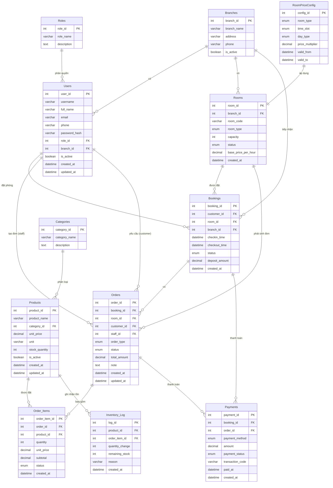

# SOFTWARE REQUIREMENTS SPECIFICATION (SRS)

## Hệ thống Quản lý Chuỗi Karaoke StarChain

| **Phiên bản** | **Ngày** | **Phân loại** |
|---|---|---|
| 1.0 | 17/07/2026 | IEEE Std 830-1998 |

---

## Lịch sử sửa đổi

| Phiên bản | Ngày | Người soạn | Nội dung thay đổi |
|---|---|---|---|
| 1.0 | 17/07/2026 | Senior BA | Phiên bản đầu tiên |

---

## Mục lục

1. [Giới thiệu](#1-gi%E1%BB%9Bi-thi%E1%BB%87u-introduction)
   - 1.1 Mục đích
   - 1.2 Phạm vi
2. [Mô tả tổng quan](#2-m%C3%B4-t%E1%BA%A3-t%E1%BB%95ng-quan-overall-description)
   - 2.1 Bối cảnh sản phẩm
   - 2.2 Tóm tắt chức năng chính
   - 2.3 Phân nhóm người dùng
   - 2.4 Ràng buộc thiết kế và công nghệ
3. [Yêu cầu cụ thể](#3-y%C3%AAu-c%E1%BA%A7u-c%E1%BB%A5-th%E1%BB%83-specific-requirements)
   - 3.1 Yêu cầu chức năng
   - 3.2 Yêu cầu phi chức năng
   - 3.3 Quy tắc nghiệp vụ
- [Phụ lục A: Sơ đồ ERD](#ph%E1%BB%A5-l%E1%BB%A5c-a-s%C6%A1-%C4%91%E1%BB%93-th%E1%BB%B1c-th%E1%BB%83---m%E1%BB%91i-quan-h%E1%BB%87-erd)
- [Phụ lục B: Bảng thuật ngữ](#ph%E1%BB%A5-l%E1%BB%A5c-b-b%E1%BA%A3ng-thu%E1%BA%ADt-ng%E1%BB%AF-glossary)

---

## 1. Giới thiệu (Introduction)

### 1.1 Mục đích (Purpose)

Tài liệu Software Requirements Specification (SRS) này mô tả chi tiết các yêu cầu chức năng và phi chức năng của hệ thống Quản lý Chuỗi Karaoke StarChain. Tài liệu được biên soạn theo chuẩn IEEE Std 830-1998, nhằm làm cơ sở cho đội ngũ phát triển (Developers), kiểm thử (QA/QC) và các bên liên quan trong suốt vòng đời dự án.

### 1.2 Phạm vi (Scope)

#### 1.2.1 Trong phạm vi (In Scope)

- Quản lý đặt phòng: Tìm kiếm, đặt trước, đặt cọc online, check-in / check-out phòng hát.
- Quản lý trạng thái phòng thời gian thực (Trống, Đang dọn, Đang sử dụng, Đã đặt).
- Gọi món F&B tại phòng qua QR (dành cho khách) hoặc màn hình POS (dành cho nhân viên).
- Tự động chuyển yêu cầu gọi món đến bộ phận Bếp / Kho.
- Quản lý tồn kho: Tự động trừ nguyên vật liệu khi món ăn được xác nhận giao.
- Chuyển đổi phòng và gộp phòng theo yêu cầu.
- Tính tiền tự động: Chốt giờ, tính tiền theo bảng giá khung giờ, tổng hợp dịch vụ, thuế, phí.
- Hỗ trợ đa phương thức thanh toán: Tiền mặt, Chuyển khoản (QR tĩnh/động), Ví điện tử.
- Báo cáo doanh thu, hiệu suất phòng, thống kê F&B bán chạy (Admin).
- Quản trị hệ thống: Cấu hình phòng, bảng giá, sản phẩm, nguyên vật liệu (Admin).

#### 1.2.2 Ngoài phạm vi (Out of Scope)

- Tích hợp Camera AI / Nhận diện khuôn mặt khách hàng.
- Module Quản trị Nhân sự (HRM): Chấm công, tính lương nhân viên.
- Website / Landing page giới thiệu thương hiệu (không bao gồm tính năng đặt phòng).
- Tích hợp sâu với các hệ thống Kế toán (MISA, Fast...) ở giai đoạn này.
- Module Chăm sóc khách hàng (CRM): Gửi email/SMS marketing, chương trình thành viên.
- Ứng dụng di động cho nhân viên (Staff App) ở phiên bản 1.0.

---

## 2. Mô tả tổng quan (Overall Description)

### 2.1 Bối cảnh sản phẩm (Product Perspective)

Karaoke StarChain là một hệ thống quản lý tập trung dành cho chuỗi phòng hát karaoke phân khúc cận cao cấp với nhiều chi nhánh. Hệ thống bao gồm ba phân hệ chính: (1) Quản lý Đặt phòng & Phòng hát, (2) Gọi món & Dịch vụ tại phòng (POS/F&B), và (3) Thanh toán & Báo cáo.

Hệ thống hoạt động theo mô hình Client-Server với kiến trúc microservices trên nền tảng đám mây (Cloud-native). Người dùng tương tác qua 03 kênh chính: Ứng dụng web (Admin/Staff), Ứng dụng di động (Customer), và thiết bị POS tại quầy (Staff).

```mermaid
graph TD
    %% Actors
    Customer([Khách hàng])
    Staff([Nhân viên])
    Admin([Quản trị viên / Chủ chuỗi])

    %% Use Cases - Booking
    UC1(Tra cứu phòng trống)
    UC2(Đặt phòng & đặt cọc online)
    UC3(Check-in khách)
    UC4(Chuyển / Gộp phòng)

    %% Use Cases - F&B
    UC5(Gọi món F&B)
    UC6(Xác nhận & chuyển bếp)
    UC7(Trừ tồn kho tự động)

    %% Use Cases - Billing & Report
    UC8(Tính tiền & chốt hóa đơn)
    UC9(Thanh toán đa phương thức)
    UC10(In hóa đơn)
    UC11(Xem báo cáo doanh thu)
    UC12(Xem báo cáo hiệu suất phòng)
    UC13(Xem thống kê F&B bán chạy)
    UC14(Quản lý cấu hình phòng & giá)
    UC15(Quản lý kho & sản phẩm)

    %% Relationships
    Customer --> UC1
    Customer --> UC2
    Customer --> UC5
    Customer --> UC8
    Customer --> UC9

    Staff --> UC3
    Staff --> UC4
    Staff --> UC5
    Staff --> UC6
    Staff --> UC8
    Staff --> UC9
    Staff --> UC10

    Admin --> UC11
    Admin --> UC12
    Admin --> UC13
    Admin --> UC14
    Admin --> UC15

    %% System boundaries
    subgraph "Phân hệ Đặt phòng & Quản lý phòng"
        UC1
        UC2
        UC3
        UC4
    end

    subgraph "Phân hệ Gọi món & Dịch vụ"
        UC5
        UC6
        UC7
    end

    subgraph "Phân hệ Thanh toán & Báo cáo"
        UC8
        UC9
        UC10
        UC11
        UC12
        UC13
    end

    subgraph "Phân hệ Quản trị"
        UC14
        UC15
    end
```

> **Ghi chú**: UC7 (Trừ tồn kho tự động) là use case hệ thống tự động thực thi, không gắn với actor cụ thể.

### 2.2 Tóm tắt chức năng chính (Product Functions)

| Phân hệ | Mã số | Chức năng | Tác nhân |
|---|---|---|---|
| Đặt phòng & Quản lý phòng | FR-001 đến FR-004 | Tra cứu, Đặt phòng, Check-in, Cập nhật trạng thái | Customer, Staff |
| Gọi món & Dịch vụ | FR-005 đến FR-008 | Gọi món F&B, Chuyển bếp, Trừ kho, Chuyển/Gộp phòng | Customer, Staff |
| Thanh toán & Báo cáo | FR-009 đến FR-014 | Tính tiền, Hóa đơn, Thanh toán, Báo cáo doanh thu/Hiệu suất/F&B | Staff, Admin |

### 2.3 Phân nhóm người dùng (User Classes and Characteristics)

| Nhóm người dùng | Mô tả | Đặc điểm |
|---|---|---|
| Khách hàng (Customer) | Người trực tiếp trải nghiệm dịch vụ tại chi nhánh hoặc đặt phòng online. | Số lượng lớn, không yêu cầu đào tạo. Sử dụng qua web/app di động. Cần UX đơn giản, trực quan. |
| Nhân viên / Thu ngân (Staff) | Nhân viên trực chi nhánh, thao tác hàng ngày trên hệ thống POS. | Số lượng giới hạn theo chi nhánh (~5-15 người/chi nhánh). Thao tác nhanh, chính xác. Cần đào tạo cơ bản. |
| Quản trị viên (Admin) | Chủ chuỗi / Quản lý cấp cao, theo dõi toàn bộ hoạt động kinh doanh. | Số lượng rất ít (1-5 người). Cần dashboard trực quan, báo cáo tổng hợp, phân quyền chi tiết. |

### 2.4 Ràng buộc thiết kế và công nghệ (Design and Implementation Constraints)

#### 2.4.1 Ràng buộc công nghệ (Technology Stack)

| Thành phần | Công nghệ / Nền tảng |
|---|---|
| Backend API | Java Spring Boot 3.x (hoặc .NET 8) — Kiến trúc Microservices |
| Frontend Admin/Staff | React 18 + TypeScript + Ant Design / Material UI |
| Mobile App (Customer) | React Native (Cross-platform iOS & Android) |
| Database | PostgreSQL 16 + Redis (cache) + MongoDB (logs) |
| Message Queue | RabbitMQ / Apache Kafka cho xử lý real-time |
| API Gateway | Kong / NGINX + JWT Authentication |
| Cloud | AWS / GCP (Containerized via Docker + Kubernetes) |

#### 2.4.2 Ràng buộc kiến trúc (Architectural Constraints)

- Hệ thống phải tuân thủ mô hình Client-Server, mọi logic nghiệp vụ xử lý ở tầng Backend.
- API thiết kế theo chuẩn RESTful, sử dụng JSON làm định dạng trao đổi dữ liệu.
- Phân quyền truy cập dựa trên Role-Based Access Control (RBAC) ở tầng API Gateway.
- Dữ liệu nhạy cảm (mật khẩu, thông tin thanh toán) phải được mã hóa ở cả 2 tầng: lưu trữ (AES-256) và truyền tải (TLS 1.3).
- Tích hợp CI/CD pipeline tự động (GitHub Actions / GitLab CI).

---

## 3. Yêu cầu cụ thể (Specific Requirements)

### 3.1 Yêu cầu chức năng (Functional Requirements)

#### FR-001: Tra cứu phòng trống

| Thuộc tính | Giá trị |
|---|---|
| Mã yêu cầu | FR-001 |
| Tên chức năng | Tra cứu phòng trống |
| Tác nhân | Khách hàng (Customer) |
| Mô tả | Cho phép khách hàng tìm kiếm phòng trống theo chi nhánh, loại phòng (Thường / VIP / Super VIP), khung giờ và ngày mong muốn. |

**Luồng xử lý chính (Happy Path):**

1. Khách hàng truy cập màn hình tìm kiếm phòng.
2. Hệ thống hiển thị danh sách chi nhánh và bộ lọc (loại phòng, khung giờ, ngày).
3. Khách hàng chọn chi nhánh và nhập các tiêu chí tìm kiếm.
4. Hệ thống truy vấn cơ sở dữ liệu, trả về danh sách phòng trống đáp ứng tiêu chí.
5. Hệ thống hiển thị thông tin từng phòng: loại phòng, sức chứa, giá cơ bản và trạng thái.

**Trường hợp ngoại lệ (Edge Cases):**

- Không có phòng trống đáp ứng tiêu chí: Hệ thống thông báo "Không có phòng trống" và gợi ý các khung giờ hoặc loại phòng khác.
- Chi nhánh tạm dừng hoạt động: Ẩn chi nhánh khỏi danh sách tìm kiếm.
- Khung giờ tìm kiếm không hợp lệ (quá khứ): Hệ thống tự động chặn & thông báo lỗi.

---

#### FR-002: Đặt phòng & đặt cọc online

| Thuộc tính | Giá trị |
|---|---|
| Mã yêu cầu | FR-002 |
| Tên chức năng | Đặt phòng & đặt cọc online |
| Tác nhân | Khách hàng (Customer) |
| Mô tả | Khách hàng có thể đặt giữ phòng trước qua hệ thống và thực hiện thanh toán đặt cọc trực tuyến để xác nhận đặt phòng. |

**Luồng xử lý chính (Happy Path):**

1. Khách hàng chọn phòng từ kết quả tìm kiếm (FR-001).
2. Hệ thống hiển thị form đặt phòng: Thông tin liên hệ, khung giờ, dịch vụ kèm.
3. Khách hàng nhập thông tin và submit.
4. Hệ thống tạo booking với trạng thái "Chờ đặt cọc" và chuyển qua cổng thanh toán.
5. Khách hàng thực hiện đặt cọc online thành công.
6. Hệ thống cập nhật trạng thái phòng thành "Đã đặt trước" (Booked) và gửi email/SMS xác nhận.

**Trường hợp ngoại lệ (Edge Cases):**

- Khách hàng không đặt cọc trong thời gian quy định: Hệ thống tự động hủy booking và giải phóng phòng.
- Đặt cọc thất bại (lỗi cổng thanh toán, số dư không đủ): Booking giữ nguyên trạng thái, hiển thị thông báo lỗi chi tiết.
- Trùng lịch đặt: Hệ thống kiểm tra tính khả dụng trước khi xác nhận, tránh double-booking.
- Phòng được đặt cách ngày hiện tại > 30 ngày: Yêu cầu xác nhận Admin trước khi duyệt.

---

#### FR-003: Cập nhật trạng thái phòng tự động

| Thuộc tính | Giá trị |
|---|---|
| Mã yêu cầu | FR-003 |
| Tên chức năng | Cập nhật trạng thái phòng tự động |
| Tác nhân | Hệ thống (tự động) |
| Mô tả | Trạng thái phòng được tự động cập nhật dựa trên các sự kiện nghiệp vụ (Trống, Đang dọn dẹp, Đang sử dụng, Đã đặt trước). |

**Luồng xử lý chính (Happy Path):**

1. Sự kiện nghiệp vụ phát sinh (ví dụ: khách check-in, check-out, đặt phòng, bắt đầu dọn).
2. Hệ thống nhận sự kiện qua Event Bus (Kafka/RabbitMQ).
3. Hệ thống cập nhật trạng thái tương ứng trong CSDL.
4. Hệ thống broadcast thay đổi đến các client đang kết nối (WebSocket).

**Trường hợp ngoại lệ (Edge Cases):**

- Cập nhật thất bại (DB error): Ghi vào Dead-Letter Queue, gửi cảnh báo Admin.
- Xung đột trạng thái (ví dụ: cùng lúc check-in và đang dọn dẹp): State Machine kiểm tra tính hợp lệ, từ chối chuyển trạng thái không hợp lệ.

---

#### FR-004: Check-in khách

| Thuộc tính | Giá trị |
|---|---|
| Mã yêu cầu | FR-004 |
| Tên chức năng | Check-in khách |
| Tác nhân | Nhân viên (Staff) |
| Mô tả | Nhân viên thực hiện check-in cho khách đã đặt trước (online) hoặc khách vãng lai (walk-in) tại quầy. Hệ thống tự động kích hoạt bộ đếm thời gian sử dụng. |

**Luồng xử lý chính (Happy Path):**

1. Nhân viên chọn chức năng Check-in trên màn hình POS.
2. Chọn khách đã đặt trước (Nhập số điện thoại / Mã booking) hoặc tạo booking mới (Walk-in).
3. Hệ thống kiểm tra tính hợp lệ (phòng còn trống, khách đã đặt cọc đầy đủ).
4. Hệ thống chuyển trạng thái phòng thành "Đang sử dụng" và bắt đầu tính giờ.
5. Hệ thống thông báo check-in thành công.

**Trường hợp ngoại lệ (Edge Cases):**

- Khách đến sớm hơn giờ đặt > 30 phút: Hệ thống cảnh báo và đề nghị xác nhận lại từ nhân viên.
- Phòng chưa được dọn dẹp: Chặn check-in, hiển thị thông báo "Phòng đang dọn dẹp".
- Khách walk-in không có phòng trống: Chuyển đến danh sách chờ hoặc gợi ý chi nhánh khác.

---

#### FR-005: Gọi món F&B

| Thuộc tính | Giá trị |
|---|---|
| Mã yêu cầu | FR-005 |
| Tên chức năng | Gọi món F&B |
| Tác nhân | Khách hàng / Nhân viên |
| Mô tả | Khách hàng quét QR tại phòng hoặc nhân viên thao tác qua màn hình POS để gọi món (bia, nước ngọt, trái cây, đồ ăn nhẹ) gán vào số phòng đang sử dụng. |

**Luồng xử lý chính (Happy Path):**

1. Khách quét QR tại phòng -> Mở menu F&B; hoặc Nhân viên chọn phòng -> Mở menu.
2. Hệ thống hiển thị danh mục sản phẩm theo loại, giá, tồn kho.
3. Người dùng thêm sản phẩm vào giỏ hàng và submit đơn hàng.
4. Hệ thống kiểm tra tồn kho, tạo đơn hàng (Orders) với trạng thái "Chờ xác nhận".

**Trường hợp ngoại lệ (Edge Cases):**

- Sản phẩm hết hàng: Hiển thị trạng thái "Hết hàng" hoặc thông báo khi thêm vào giỏ.
- Phòng chưa được check-in: Chặn gọi món, thông báo "Vui lòng đặt phòng trước".
- Giỏ hàng trống khi submit: Vô hiệu hóa nút submit.

---

#### FR-006: Chuyển yêu cầu gọi món đến bộ phận Bếp / Kho

| Thuộc tính | Giá trị |
|---|---|
| Mã yêu cầu | FR-006 |
| Tên chức năng | Chuyển yêu cầu gọi món đến bộ phận Bếp / Kho |
| Tác nhân | Hệ thống (tự động) |
| Mô tả | Sau khi đơn hàng F&B được tạo, hệ thống tự động chuyển thông báo đến màn hình Bếp/Kho kèm chi tiết món ăn và số phòng. |

**Luồng xử lý chính (Happy Path):**

1. Hệ thống nhận sự kiện đơn hàng mới từ FR-005.
2. Hệ thống đẩy thông báo qua WebSocket đến màn hình Bếp/Kho.
3. Bộ phận Bếp/Kho nhận được danh sách món cần chuẩn bị.
4. Nhân viên bếp xác nhận đã nhận đơn.

**Trường hợp ngoại lệ (Edge Cases):**

- Kết nối WebSocket gián đoạn: Hệ thống lưu hàng đợi và retry tối đa 3 lần.
- Màn hình Bếp offline: Chuyển sang gửi SMS/Zalo cho số điện thoại trực ca bếp.
- Thời gian chờ xác nhận quá 5 phút: Tự động tăng mức ưu tiên và gửi cảnh báo đến quản lý ca.

---

#### FR-007: Trừ tồn kho tự động

| Thuộc tính | Giá trị |
|---|---|
| Mã yêu cầu | FR-007 |
| Tên chức năng | Trừ tồn kho tự động |
| Tác nhân | Hệ thống (tự động) |
| Mô tả | Khi món ăn được xác nhận giao thành công, hệ thống tự động trừ số lượng nguyên vật liệu / sản phẩm trong kho tương ứng. |

**Luồng xử lý chính (Happy Path):**

1. Nhân viên bếp xác nhận "Giao thành công" cho món ăn.
2. Hệ thống ghi nhận sự kiện và lookup sản phẩm / công thức.
3. Hệ thống trừ số lượng tồn kho tương ứng.
4. Hệ thống ghi log vào bảng Inventory_Log.

**Trường hợp ngoại lệ (Edge Cases):**

- Tồn kho không đủ để trừ: Chặn xác nhận giao, thông báo "Tồn kho không đủ" và đề nghị nhập kho bổ sung.
- Không tìm thấy sản phẩm trong danh sách nguyên vật liệu: Bỏ qua, ghi log và thông báo Admin.
- Trừ trùng (duplicate event): Hệ thống kiểm tra theo idempotency key để tránh trừ 2 lần.

---

#### FR-008: Chuyển / Gộp phòng

| Thuộc tính | Giá trị |
|---|---|
| Mã yêu cầu | FR-008 |
| Tên chức năng | Chuyển / Gộp phòng |
| Tác nhân | Nhân viên (Staff) |
| Mô tả | Nhân viên có thể chuyển khách sang phòng khác hoặc gộp nhiều phòng thành một khi có yêu cầu phát sinh. |

**Luồng xử lý chính (Happy Path):**

1. Nhân viên chọn chức năng Chuyển / Gộp phòng.
2. Hệ thống hiển thị danh sách phòng đang sử dụng.
3. Nhân viên chọn phòng nguồn và phòng đích (chuyển) hoặc nhiều phòng nguồn (gộp).
4. Hệ thống kiểm tra tính hợp lệ và thực hiện cập nhật.
5. Hệ thống chuyển dữ liệu order / dịch vụ từ phòng cũ sang phòng mới.

**Trường hợp ngoại lệ (Edge Cases):**

- Phòng đích đang có khách sử dụng: Chỉ cho phép nếu là gộp phòng (merge).
- Phòng đích đang dọn dẹp: Chặn thao tác, yêu cầu hoàn tất dọn trước.
- Chuyển phòng khi đã có hóa đơn tạm tính: Cảnh báo và yêu cầu xác nhận từ Admin.

---

#### FR-009: Tính tiền & chốt hóa đơn

| Thuộc tính | Giá trị |
|---|---|
| Mã yêu cầu | FR-009 |
| Tên chức năng | Tính tiền & chốt hóa đơn |
| Tác nhân | Nhân viên / Khách hàng |
| Mô tả | Khi khách yêu cầu tính tiền, hệ thống tự động chốt thời gian sử dụng và tính toán dựa trên bảng giá cấu hình. |

**Luồng xử lý chính (Happy Path):**

1. Nhân viên hoặc khách hàng chọn "Tính tiền" cho phòng đang sử dụng.
2. Hệ thống chốt thời gian sử dụng, dừng bộ đếm giờ.
3. Hệ thống tính tiền giờ dựa trên bảng giá (khung giờ vàng / thường).
4. Hệ thống tổng hợp tiền dịch vụ + thuế + phí dịch vụ (FR-010).
5. Hệ thống tạo hóa đơn hoàn chỉnh, trả về cho màn hình POS.

**Trường hợp ngoại lệ (Edge Cases):**

- Phòng có order F&B chưa hoàn tất: Hệ thống chờ xác nhận hoàn tất hoặc tách hóa đơn.
- Khách check-out sớm hơn giờ đặt: Áp dụng chính sách tính theo giờ thực tế (tối thiểu 1 giờ).
- Check-out muộn: Tự động tính phụ thu theo bảng giá check-out muộn.

---

#### FR-010: Tổng hợp hóa đơn hoàn chỉnh

| Thuộc tính | Giá trị |
|---|---|
| Mã yêu cầu | FR-010 |
| Tên chức năng | Tổng hợp hóa đơn hoàn chỉnh |
| Tác nhân | Hệ thống (tự động) |
| Mô tả | Hệ thống tự động tổng hợp tiền giờ, tiền dịch vụ F&B, thuế VAT và phí dịch vụ thành hóa đơn hoàn chỉnh. |

**Luồng xử lý chính (Happy Path):**

1. Hệ thống nhận yêu cầu tính tiền (từ FR-009).
2. Hệ thống lấy dữ liệu: thời gian sử dụng, danh sách order F&B, bảng giá.
3. Tính tiền giờ = Số giờ x Đơn giá (có xét hệ số khung giờ vàng).
4. Tính tiền F&B = Tổng tiền Order_Items (giá snapshot tại thời điểm gọi món).
5. Tính thuế VAT (8%) và phí dịch vụ (5%) trên tổng tiền.
6. Tạo bản ghi trong bảng Payments với tổng tiền và trạng thái "Chờ thanh toán".
7. Trả về hóa đơn chi tiết.

**Trường hợp ngoại lệ (Edge Cases):**

- Thay đổi giá sau khi đặt hàng: Áp dụng giá snapshot của từng order, không thay đổi theo giá hiện tại.
- Hóa đơn có mức thuế suất khác (hàng hóa chịu thuế TTDB): Áp dụng riêng cho từng loại sản phẩm.
- Làm tròn số: Làm tròn đến hàng đơn vị (làm tròn toán học).

---

#### FR-011: Thanh toán đa phương thức

| Thuộc tính | Giá trị |
|---|---|
| Mã yêu cầu | FR-011 |
| Tên chức năng | Thanh toán đa phương thức |
| Tác nhân | Nhân viên / Khách hàng |
| Mô tả | Hệ thống hỗ trợ thanh toán bằng Tiền mặt, Chuyển khoản (QR động) và Ví điện tử. |

**Luồng xử lý chính (Happy Path):**

1. Hệ thống hiển thị hóa đơn và danh sách phương thức thanh toán.
2. Khách hàng / Nhân viên chọn phương thức.
3. Trường hợp Tiền mặt: Nhân viên nhập số tiền khách đưa, hệ thống tính tiền thừa và xác nhận.
4. Trường hợp Chuyển khoản: Hệ thống sinh mã QR động, chờ callback từ cổng thanh toán.
5. Trường hợp Ví điện tử: Hệ thống gọi API cổng thanh toán và chờ kết quả.
6. Hệ thống cập nhật trạng thái thanh toán "Thành công" và chuyển trạng thái phòng thành "Đang dọn dẹp".

**Trường hợp ngoại lệ (Edge Cases):**

- Thanh toán chuyển khoản timeout: Hệ thống gửi email/SMS nhắc, Admin có thể xác nhận thủ công.
- Thanh toán một phần: Hệ thống hỗ trợ ghi nhận nhiều giao dịch cho một hóa đơn (split payment).
- QR động hết hạn: Hệ thống tự động sinh lại QR mới nếu quá thời gian hiệu lực (5 phút).
- Lỗi kết nối cổng thanh toán: Chuyển về phương thức dự phòng (Tiền mặt).

---

#### FR-012: Báo cáo doanh thu

| Thuộc tính | Giá trị |
|---|---|
| Mã yêu cầu | FR-012 |
| Tên chức năng | Báo cáo doanh thu |
| Tác nhân | Admin / Chủ chuỗi |
| Mô tả | Admin có thể xem báo cáo doanh thu theo ngày / tháng / năm, lọc theo chi nhánh và xuất dữ liệu. |

**Luồng xử lý chính (Happy Path):**

1. Admin truy cập trang Báo cáo doanh thu.
2. Chọn khoảng thời gian và tùy chọn chi nhánh.
3. Hệ thống truy vấn dữ liệu thanh toán và hiển thị dashboard (biểu đồ, bảng số).
4. Admin có thể xuất báo cáo sang PDF / Excel.

**Trường hợp ngoại lệ (Edge Cases):**

- Khoảng thời gian không hợp lệ (ngày bắt đầu > ngày kết thúc): Chặn và thông báo.
- Không có dữ liệu trong khoảng thời gian: Hiển thị thông báo "Không có dữ liệu".
- Xuất file thất bại (lỗi hệ thống): Thông báo lỗi và gửi yêu cầu xuất lại.

---

#### FR-013: Báo cáo hiệu suất phòng

| Thuộc tính | Giá trị |
|---|---|
| Mã yêu cầu | FR-013 |
| Tên chức năng | Báo cáo hiệu suất phòng |
| Tác nhân | Admin / Chủ chuỗi |
| Mô tả | Admin xem báo cáo tỷ lệ sử dụng phòng (Occupancy Rate) theo thời gian, so sánh giữa các chi nhánh. |

**Luồng xử lý chính (Happy Path):**

1. Admin truy cập trang Báo cáo hiệu suất.
2. Chọn khoảng thời gian và chi nhánh.
3. Hệ thống tính toán: Occupancy Rate = (Tổng giờ sử dụng / Tổng giờ khả dụng) x 100%.
4. Hiển thị biểu đồ theo ngày, loại phòng.

**Trường hợp ngoại lệ (Edge Cases):**

- Chi nhánh mới chưa có dữ liệu lịch sử: Hiển thị 0% kèm ghi chú "Chưa có dữ liệu".
- Số liệu không khả dụng do trùng lịch bảo trì: Loại trừ các ngày bảo trì khỏi công thức tính.

---

#### FR-014: Thống kê F&B bán chạy

| Thuộc tính | Giá trị |
|---|---|
| Mã yêu cầu | FR-014 |
| Tên chức năng | Thống kê F&B bán chạy |
| Tác nhân | Admin / Chủ chuỗi |
| Mô tả | Admin xem báo cáo top sản phẩm F&B bán chạy nhất dựa trên số lượng đơn hàng theo thời gian. |

**Luồng xử lý chính (Happy Path):**

1. Admin truy cập trang Thống kê F&B.
2. Chọn khoảng thời gian, chi nhánh, và số lượng top (5 / 10 / 20).
3. Hệ thống tổng hợp Order_Items theo product_id, tính tổng quantity.
4. Hiển thị danh sách sản phẩm bán chạy kèm biểu đồ trực quan.

**Trường hợp ngoại lệ (Edge Cases):**

- Thay đổi giá hoặc tên sản phẩm qua thời gian: Thống kê dựa trên product_id, sử dụng tên mới nhất.
- Sản phẩm đã ngừng kinh doanh: Vẫn hiển thị trong báo cáo lịch sử, kèm nhãn "Ngừng kinh doanh".

---

### 3.2 Yêu cầu phi chức năng (Non-Functional Requirements)

| ID | Phân loại | Yêu cầu | Chỉ tiêu kỹ thuật |
|---|---|---|---|
| NFR-001 | Hiệu năng | Xử lý real-time cho gọi món và cập nhật trạng thái phòng. | Độ trễ tối đa ≤ 3 giây dưới tải bình thường (500 concurrent users). |
| NFR-002 | Hiệu năng | Đáp ứng đồng thời tối thiểu 200 yêu cầu đặt phòng / thanh toán cùng lúc. | Throughput ≥ 200 TPS cho API tính tiền và thanh toán. |
| NFR-003 | Bảo mật | Mã hóa đầu cuối mọi giao dịch đặt cọc và thanh toán. | TLS 1.3+ cho truyền tải, AES-256 cho lưu trữ. Tuân thủ PCI DSS. |
| NFR-004 | Bảo mật | Phân quyền truy cập chặt chẽ dựa trên RBAC. | Mỗi API endpoint phải xác thực và phân quyền (JWT + Role check). |
| NFR-005 | Khả năng mở rộng | Kiến trúc đa chi nhánh, cho phép thêm chi nhánh mới mà không sửa code lõi. | Cấu hình chi nhánh qua file config / database, không cần deploy lại toàn bộ hệ thống. |
| NFR-006 | Khả năng mở rộng | Database và API hỗ trợ scale ngang (horizontal scaling). | Hỗ trợ Database read replicas, API có thể chạy nhiều instance sau Load Balancer. |
| NFR-007 | Tính tương thích | Customer App hoạt động trên cả iOS và Android cùng giao diện web responsive. | Tương thích iOS 14+/Android 8+, Web trên Chrome/Firefox/Edge/Safari. |
| NFR-008 | Tính tương thích | Tích hợp tối thiểu 3 cổng thanh toán thông dụng. | Hỗ trợ: VNPay, Momo, ZaloPay (và các cổng khác qua cơ chế plug-in). |
| NFR-009 | Tính tương thích | Module báo cáo có xuất PDF/Excel và API kết nối BI. | REST API cho phép kết nối Power BI / Tableau. Export file không quá 20MB. |
| NFR-010 | Khả dụng (Availability) | Hệ thống phải có tính sẵn sàng cao, đặc biệt khung giờ cao điểm (18:00 - 23:00 hàng ngày). | Uptime ≥ 99.5%. Downtime tối đa không quá 15 phút/ngày. |
| NFR-011 | Bảo mật | Chống tấn công phổ biến: SQL Injection, XSS, CSRF, Brute Force. | Input validation ở tầng API Gateway. Rate limiting: tối đa 100 request/phút/IP cho API đặt phòng. |

### 3.3 Quy tắc nghiệp vụ (Business Rules)

| Mã số | Quy tắc | Mô tả | Mức độ |
|---|---|---|---|
| BR-001 | Double-booking prevention | Một phòng không thể có 2 booking đang hoạt động (status = Pending/Deposited/CheckedIn) trong cùng một khung giờ. Hệ thống phải kiểm tra chặt trước khi tạo booking mới. | Bắt buộc |
| BR-002 | Minimum charge rule | Mỗi lượt sử dụng phòng tối thiểu tính 1 giờ, kể cả khách check-out trước 1 giờ. | Bắt buộc |
| BR-003 | Price snapshot | Giá sản phẩm trong Order_Items là snapshot tại thời điểm tạo đơn, không thay đổi theo bảng giá sau này. | Bắt buộc |
| BR-004 | Room state machine | Trạng thái phòng chỉ có thể chuyển theo State Machine: Available ↔ Booked ↔ InUse ↔ Cleaning ↔ Available. Không cho phép chuyển trạng thái không hợp lệ. | Bắt buộc |
| BR-005 | Deposit validation | Booking online chỉ được xác nhận khi khách đã đặt cọc ≥ 30% tổng giá trị đơn hàng dự kiến (có thể cấu hình). | Có thể cấu hình |
| BR-006 | Peak hour surcharge | Khung giờ vàng (18:00 - 23:00 thứ 6, thứ 7, Chủ nhật) áp dụng hệ số nhân giá 1.5x so với giá cơ bản (có thể cấu hình). | Có thể cấu hình |
| BR-007 | Order cancellation | Đơn hàng F&B chỉ có thể hủy nếu trạng thái là 'Pending' hoặc 'Confirmed' (chưa vào bếp). Đơn đã 'Preparing' hoặc 'Delivered' không thể hủy. | Bắt buộc |
| BR-008 | Multi-branch isolation | Dữ liệu giữa các chi nhánh phải được cách ly (data isolation). Staff chỉ xem được dữ liệu thuộc chi nhánh của mình. Admin xem được toàn chuỗi. | Bắt buộc |
| BR-009 | Tax calculation | Thuế VAT áp dụng 8% (theo Nghị định 44/2023/NĐ-CP). Phí dịch vụ 5% trên tổng hóa đơn trước thuế. Các sản phẩm có thuế suất TTDB tính riêng. | Bắt buộc |
| BR-010 | Inventory integrity | Số lượng tồn kho không được âm. Mọi thay đổi tồn kho phải được ghi log vào bảng Inventory_Log kèm lý do (reason). | Bắt buộc |

---

## Phụ lục A: Sơ đồ Thực thể - Mối quan hệ (ERD)

### Mô tả chi tiết các bảng

| Bảng | Mô tả |
|---|---|
| **Branches** | Danh sách chi nhánh của chuỗi Karaoke StarChain. |
| **Roles** | Vai trò người dùng: `Customer`, `Staff`, `Admin`. |
| **Users** | Tài khoản người dùng toàn hệ thống (khách hàng, nhân viên, quản trị). |
| **Rooms** | Phòng hát tại từng chi nhánh, gồm loại phòng và trạng thái. |
| **RoomPriceConfig** | Bảng giá linh hoạt theo loại phòng, khung giờ (ngày/đêm) và ngày (thường/cuối tuần). |
| **Bookings** | Phiếu đặt phòng, quản lý thời gian check-in/check-out và trạng thái đặt cọc. |
| **Categories** | Danh mục sản phẩm F&B (đồ uống, đồ ăn nhẹ, trái cây...). |
| **Products** | Sản phẩm F&B và dịch vụ, gồm giá và tồn kho. |
| **Orders** | Đơn hàng tổng quan — sử dụng chung cho cả đặt phòng và gọi món F&B (phân biệt qua `order_type`). |
| **Order_Items** | Chi tiết từng món/sản phẩm trong đơn hàng, snapshot giá tại thời điểm đặt. |
| **Payments** | Giao dịch thanh toán — hỗ trợ nhiều phương thức (Tiền mặt, Chuyển khoản, Ví điện tử). |
| **Inventory_Log** | Audit log tồn kho — ghi lại mỗi lần xuất/nhập sản phẩm kèm số lượng tồn sau biến động. |

---

## Phụ lục B: Bảng thuật ngữ (Glossary)

| Thuật ngữ | Định nghĩa |
|---|---|
| Admin | Quản trị viên hệ thống, có quyền quản lý cấu hình và xem báo cáo toàn chuỗi. |
| Booking | Phiếu đặt phòng, ghi nhận thông tin khách hàng, phòng, thời gian và trạng thái. |
| Check-in | Quá trình xác nhận khách đến sử dụng phòng, kích hoạt bộ đếm giờ. |
| Check-out | Quá trình khách trả phòng, kết thúc tính giờ và tiến hành thanh toán. |
| F&B | Food & Beverage (Đồ ăn và Đồ uống). |
| Occupancy Rate | Tỷ lệ sử dụng phòng trong một khoảng thời gian. |
| POS | Point of Sale - Hệ thống tính tiền tại quầy. |
| RBAC | Role-Based Access Control - Phân quyền truy cập dựa trên vai trò. |
| Walk-in | Khách đến trực tiếp mà không có đặt phòng trước. |
